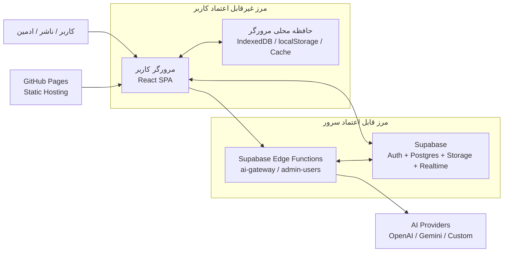
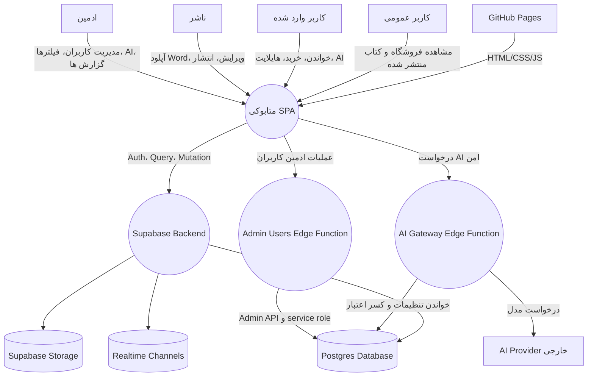
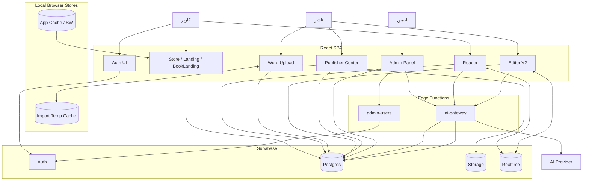
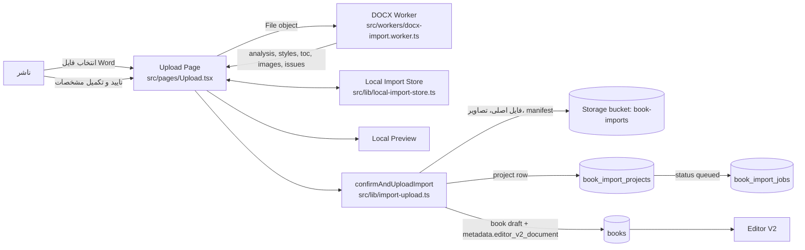
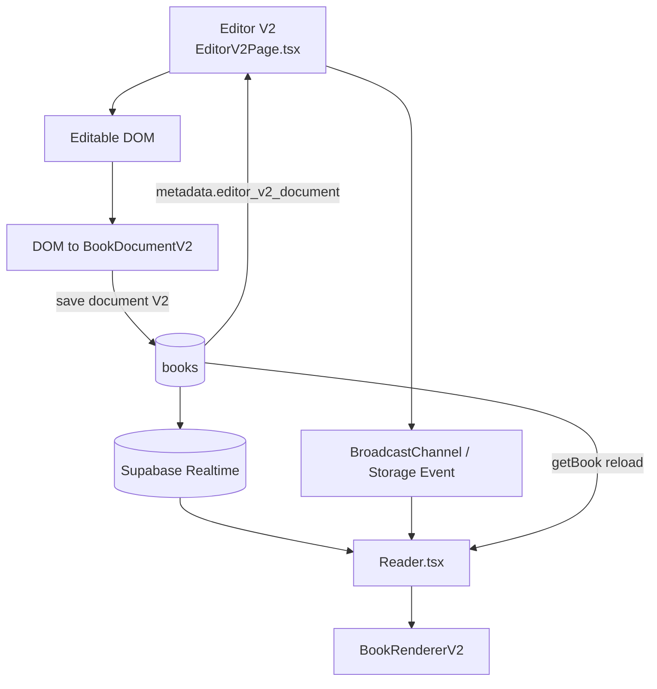
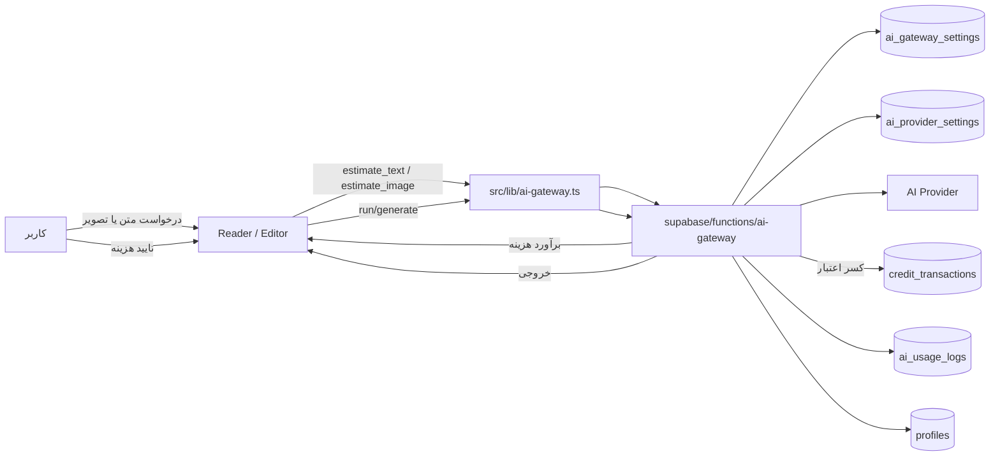
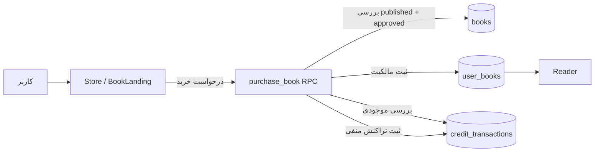
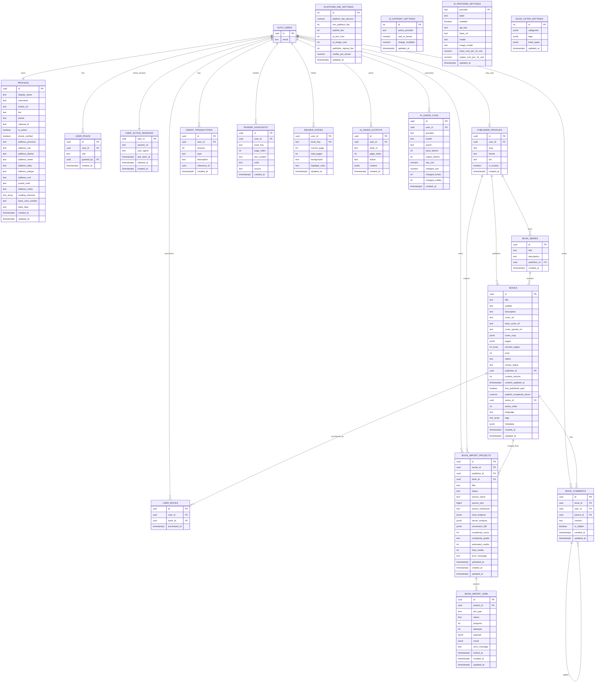
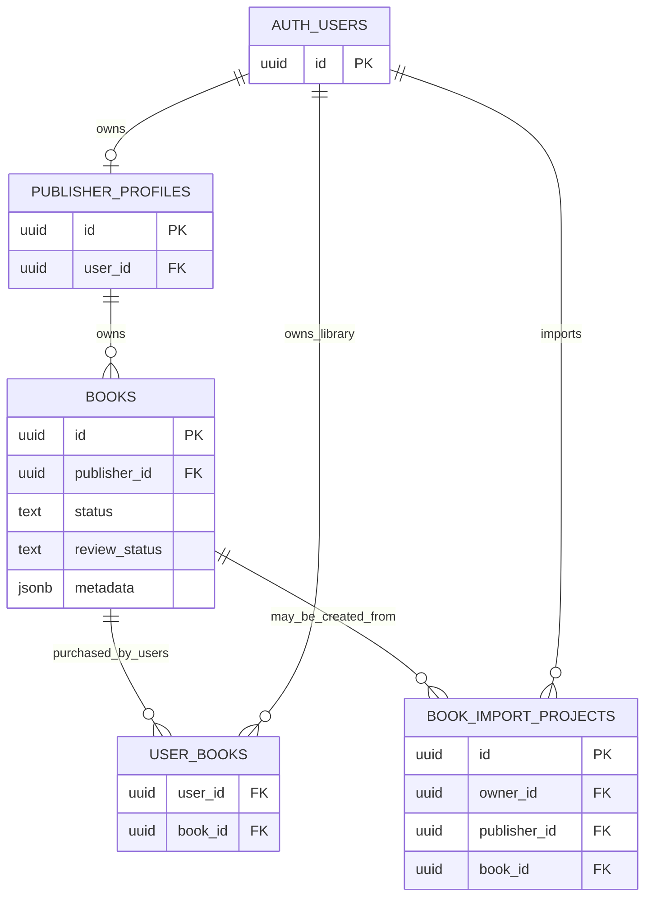

# Metabooki DFD, ERD and Sensitive Code Map

تاریخ تهیه: 2026-06-27  
نسخه بررسی شده: `APP_VERSION = 1.0.497`  
سند وابسته: `docs/SYSTEM_ARCHITECTURE_REFERENCE.md`

این سند سه چیز را یک جا نگه می دارد:

1. DFD یا نمودار جریان داده برای فهم مسیر حرکت داده ها
2. ERD یا نقشه موجودیت ها و رابطه های دیتابیس Supabase
3. نقشه کدهای حساس، یعنی فایل هایی که امنیت، پول، مالکیت کتاب، کلیدهای AI یا داده کاربر را کنترل می کنند

نکته امنیتی: این سند هیچ secret، API key، service role key یا مقدار حساس واقعی را ثبت نمی کند. فقط محل و مسئولیت کدهای حساس را نشان می دهد.

## 1. مرزهای اعتماد سیستم

اصل طراحی:

- مرورگر کاربر قابل اعتماد کامل نیست.
- RLS و Edge Function باید مالکیت و دسترسی را enforce کنند.
- کلیدهای AI و service role فقط سمت سرور/Edge Function مجاز هستند.
- localStorage و IndexedDB فقط cache یا داده موقت هستند، نه منبع حقیقت عملیاتی.
- Supabase منبع حقیقت داده های عملیاتی است.

## 2. DFD سطح صفر

## 3. DFD سطح یک: جریان های اصلی

## 4. DFD سطح دو: تبدیل Word

داده های حساس در این جریان:

- فایل Word اصلی
- تصاویر کتاب
- metadata کتاب
- گزارش مشکلات import
- شناسه ناشر و مالک

کنترل امنیتی:

- تا قبل از تایید ناشر، فایل نباید به سرور ارسال شود.
- Storage bucket `book-imports` خصوصی است.
- path فایل ها باید با `auth.uid()` شروع شود.
- هر import باید `id` مستقل داشته باشد و checksum نباید شناسه یکتای کتاب باشد.

## 5. DFD سطح دو: ادیتور، ذخیره و کتابخوان

قانون مهم:

- ادیتور و کتابخوان باید از مدل محتوای مشترک استفاده کنند.
- اگر تغییری در نمایش متن، پاورقی، کپشن، رفرنس، callout یا interactive لازم است، اول `book-content.ts` و `components/book-content-v2` بررسی شود.
- autosave نباید DOM فعال کاربر را وسط تایپ reset کند.

## 6. DFD سطح دو: هوش مصنوعی و هزینه

داده های حساس:

- API key provider
- هزینه واقعی و ضریب شارژ
- اعتبار کاربر
- متن انتخاب شده کاربر
- prompt تصویر

کنترل امنیتی:

- API key از فرانت عبور نمی کند.
- عملیات admin فقط با نقش admin/super_admin انجام شود.
- هزینه باید قبل از مصرف به کاربر اعلام شود.
- کسر اعتبار باید سمت سرور و با transaction/lock انجام شود.

## 7. DFD سطح دو: خرید کتاب و اعتبار

کنترل امنیتی:

- کتاب فقط اگر `status = published` و `review_status = approved` باشد قابل خرید است.
- خرید تکراری نباید دوباره اعتبار کم کند.
- ناشر قبل از انتشار کامل فقط کتاب خودش را می بیند و نباید بتواند کتاب ناشر دیگر را ویرایش کند.

## 8. ERD اصلی

## 9. ERD خلاصه برای مالکیت کتاب

قانون مالکیت:

- مالک واقعی کتاب `publisher_profiles.id` است.
- ناشر فقط کتاب هایی را می بیند/ویرایش می کند که `books.publisher_id` به پروفایل ناشر خودش وصل باشد.
- ادمین در پنل ادمین نظارت دارد، اما صفحه انتشارات ادمین نباید کتاب ناشران دیگر را به عنوان دارایی خودش نشان دهد.
- کتاب منتشر شده و خریداری شده نباید بدون قانون مشخص به حالت ویرایش آزاد برگردد.

## 10. نقشه کدهای حساس

| سطح حساسیت | فایل / مسیر | چرا حساس است | کنترل لازم |
|---|---|---|---|
| Secret | `supabase/functions/ai-gateway/index.ts` | کلیدهای AI، محاسبه هزینه، کسر اعتبار | کلیدها فقط server-side، admin check، log مصرف |
| Secret | `supabase/functions/admin-users/index.ts` | تغییر رمز، لیست کاربران، لینک reset | فقط admin/super_admin، عدم افشای اطلاعات اضافی |
| Secret | `.env`, Supabase secrets | URL/keyها و secretها | هرگز commit نشوند |
| Financial | `supabase/migrations/*charge_user_credits*` | کسر اعتبار کاربر | transaction، advisory lock، RLS |
| Financial | `supabase/migrations/*purchase_book*` | خرید کتاب و کم کردن اعتبار | جلوگیری از خرید تکراری، فقط کتاب published |
| Financial | `src/lib/ai-gateway.ts` | تخمین هزینه و درخواست مصرف AI | قبل از مصرف تایید کاربر، sync با Edge |
| Ownership | `supabase/migrations/*Publishers manage own books*` | دسترسی ناشر به کتاب | RLS بر اساس publisher مالک |
| Ownership | `src/lib/book-repository.ts` | دریافت کتاب های عمومی/ناشر/قفسه | جداسازی published/public از draft/private |
| Ownership | `src/lib/publisher-remote-sync.ts` | انتقال کتاب های محلی به Supabase | publisher_id صحیح، عدم overwrite کتاب مشابه |
| Ownership | `src/lib/publisher-delete.ts` | حذف کتاب و storage | فقط مالک و فقط حالت مجاز |
| User Data | `src/lib/auth-context.tsx` | نشست فعال، ورود/خروج | یک نشست فعال، پیام واضح، عدم loop خروج |
| User Data | `src/pages/Profile.tsx` | آدرس، کارت، شبا، علاقه ها | فقط کاربر خودش، masking لازم |
| Private Files | `src/lib/import-upload.ts` | آپلود Word و تصاویر | bucket خصوصی، مسیر بر اساس uid |
| Private Files | `src/workers/docx-import.worker.ts` | استخراج محتوای فایل Word | قبل از تایید فقط محلی |
| Content Integrity | `src/features/editor-v2/EditorV2Page.tsx` | تبدیل DOM به سند، save، مالکیت محتوای کتاب | عدم reset تایپ، حفظ page break، حفظ inline marks |
| Content Integrity | `src/lib/book-content.ts` | قوانین متن، ZWS، پاورقی، لینک، کپشن | مرجع واحد همه نمایش ها |
| Content Integrity | `src/components/book-content-v2/*` | رندر مشترک reader/editor preview | عدم duplicate rendering |
| Cache/Deploy | `src/lib/version-cache.ts` | رفع خطای chunk و cache | clear cache کنترل شده |
| Cache/Deploy | `public/sw.js` | Service Worker و cache assetها | همگام با APP_VERSION |
| Admin Config | `src/components/admin/AiGatewaySettingsPanel.tsx` | تنظیم مدل و کلید AI | masked key، test provider، admin only |
| Admin Config | `src/lib/filter-settings.ts` | فیلترهای فروشگاه | فقط admin برای تغییر |

## 11. ماتریس طبقه بندی داده

| داده | طبقه | محل ذخیره | دسترسی مجاز |
|---|---|---|---|
| کتاب منتشر شده | عمومی | `books` | همه کاربران و anon |
| پیش نویس کتاب | خصوصی ناشر | `books` | ناشر مالک، RLS، گاهی admin نظارتی |
| فایل Word اصلی | خصوصی | Storage `book-imports` | owner و admin |
| تصویرهای کتاب پیش نویس | خصوصی/نیمه خصوصی | Storage یا metadata | ناشر مالک |
| تصویرهای کتاب منتشر شده | عمومی | URL/Storage | همه |
| پروفایل عمومی | نیمه عمومی | `profiles`, `publisher_profiles` | بسته به فیلد |
| آدرس، کارت، شبا | حساس کاربر | `profiles` | فقط کاربر و دسترسی ادمین محدود |
| اعتبار کاربر | مالی | `credit_transactions` | کاربر خودش و admin |
| تراکنش خرید | مالی | `credit_transactions`, `user_books` | کاربر خودش و admin |
| کلید AI | Secret | `ai_provider_settings` | Edge/admin، فرانت فقط masked |
| لاگ مصرف AI | مالی/رفتاری | `ai_usage_logs` | کاربر خودش و admin |
| هایلایت و وضعیت خواندن | خصوصی کاربر | `reader_highlights`, `reader_states` | کاربر خودش |
| session فعال | امنیتی | `user_active_sessions` | کاربر خودش |

## 12. نقاطی که قبل از هر تغییر باید چک شوند

### اگر تغییر مربوط به نمایش محتوای کتاب است

اول این ها:

1. `src/lib/book-content.ts`
2. `src/components/book-content-v2/InlineTextV2.tsx`
3. `src/components/book-content-v2/BookRendererV2.tsx`
4. `src/components/book-content-v2/book-content-v2.css`

بعد مصرف کننده ها:

1. `src/pages/Reader.tsx`
2. `src/features/editor-v2/EditorV2Page.tsx`
3. `src/pages/Upload.tsx`

### اگر تغییر مربوط به مالکیت ناشر یا کتاب است

اول این ها:

1. migrations مربوط به RLS روی `books`
2. `src/lib/book-repository.ts`
3. `src/lib/publisher-remote-sync.ts`
4. `src/pages/Publisher.tsx`
5. `src/pages/Library.tsx`

### اگر تغییر مربوط به AI یا هزینه است

اول این ها:

1. `supabase/functions/ai-gateway/index.ts`
2. `src/lib/ai-gateway.ts`
3. `src/components/admin/AiGatewaySettingsPanel.tsx`
4. migrations مربوط به `ai_*` و `credit_transactions`

### اگر تغییر مربوط به import Word است

اول این ها:

1. `src/workers/docx-import.worker.ts`
2. `src/lib/word-import-types.ts`
3. `src/lib/import-document.ts`
4. `src/lib/import-upload.ts`
5. `src/pages/Upload.tsx`

## 13. RLS و سیاست های کلیدی

| جدول | سیاست اصلی |
|---|---|
| `profiles` | کاربر پروفایل خودش را می بیند/ویرایش می کند؛ ادمین می تواند ببیند |
| `user_roles` | کاربر نقش خودش را می بیند؛ ادمین مدیریت می کند |
| `publisher_profiles` | عمومی قابل مشاهده؛ ناشر مالک ویرایش می کند |
| `books` | published/approved عمومی؛ draft فقط ناشر مالک طبق policy |
| `user_books` | فقط کتابخانه کاربر خودش |
| `credit_transactions` | فقط تراکنش های کاربر خودش |
| `reader_highlights` | فقط کاربر مالک |
| `reader_states` | فقط کاربر مالک |
| `book_import_projects` | owner یا admin |
| `book_import_jobs` | owner project یا admin |
| `ai_provider_settings` | فقط admin از طریق Edge/admin |
| `book_filter_settings` | خواندن عمومی؛ مدیریت admin |
| `user_active_sessions` | فقط کاربر خودش |

## 14. ریسک های معماری که باید مراقبشان بود

### 1. مخلوط شدن داده local و Supabase

ریشه خطر:

- `publisher-books.ts`
- mock data
- localStorage fallback
- cache قدیمی browser

قاعده:

- production فقط Supabase را source of truth بداند.
- اگر fallback محلی نمایش داده شد، باید با badge و پیام واضح مشخص باشد.

### 2. قاطی شدن کتاب های هم نام

ریشه خطر:

- استفاده از title، filename یا checksum برای merge

قاعده:

- فقط `books.id` شناسه کتاب است.
- import project هم فقط با `book_import_projects.id` شناخته می شود.
- checksum فقط برای تشخیص فایل مشابه است، نه identity.

### 3. از دست رفتن markهای متن بعد از save

ریشه خطر:

- تبدیل DOM به document V2 در `EditorV2Page.tsx`

قاعده:

- هر تغییر در parser باید با این موارد تست شود: hyperlink، subscript، superscript، list، caption، citation، footnote، Greek symbols.

### 4. افشای کلید AI

ریشه خطر:

- ذخیره یا نمایش `api_key` در فرانت

قاعده:

- فرانت فقط masked key نشان دهد.
- تست و مصرف از Edge Function انجام شود.

### 5. cache ناسازگار GitHub Pages

ریشه خطر:

- Service Worker و فایل های chunk نسخه قبل

قاعده:

- `APP_VERSION`, `version.json`, `sw.js` باید با build همگام باشند.
- خطاهای dynamic import باید مسیر recovery داشته باشند.

## 15. چک لیست امنیتی قبل از deploy

1. `git status --short` هیچ فایل `.env` یا secret نداشته باشد.
2. `npm.cmd run build` پاس شود.
3. RLS برای جدول جدید فعال باشد.
4. جدول جدید policy حداقلی داشته باشد.
5. اگر Edge Function جدید اضافه شد، auth را چک کند.
6. اگر هزینه/credit تغییر کرد، محاسبه سمت server انجام شود.
7. اگر مسیر upload جدید اضافه شد، Storage policy مالکیت داشته باشد.
8. اگر داده ناشر تغییر کرد، publisher_id از کاربر فعلی resolve شود نه از ورودی خام.
9. اگر کتاب تغییر کرد، `books.id` استفاده شود نه title/file name.
10. اگر متن کتاب تغییر کرد، reader و editor هر دو تست شوند.
