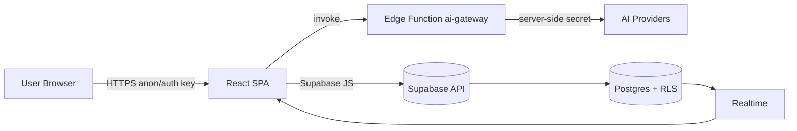
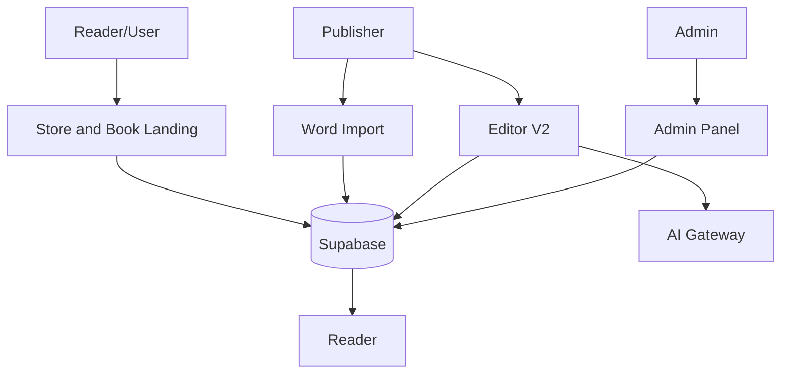
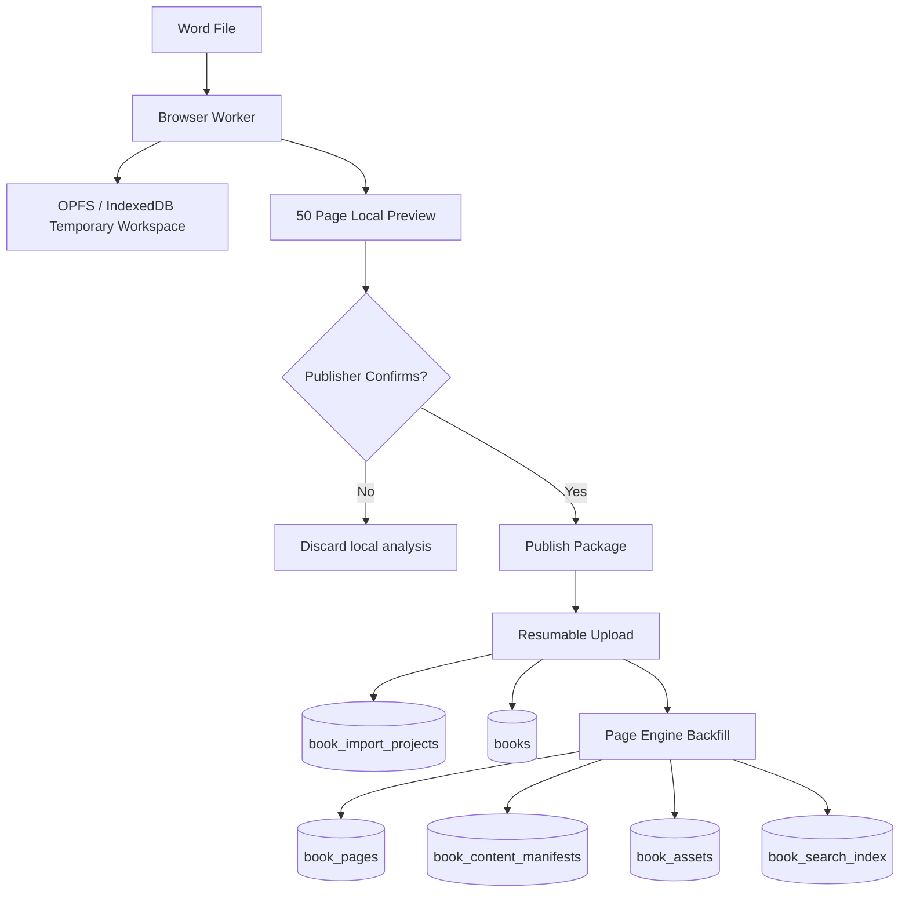
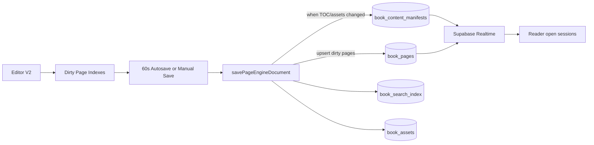
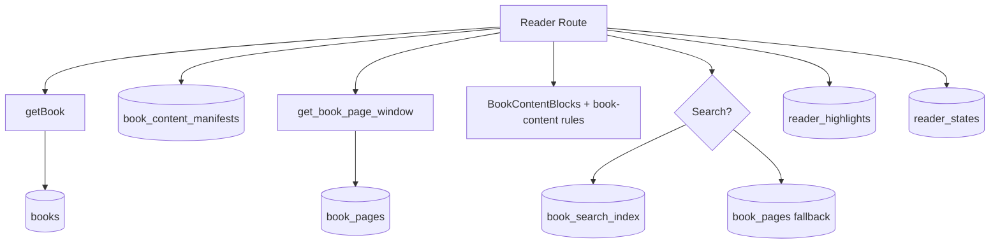
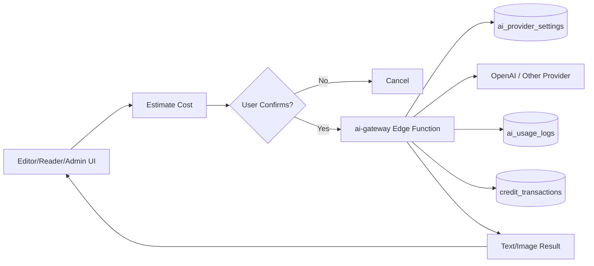
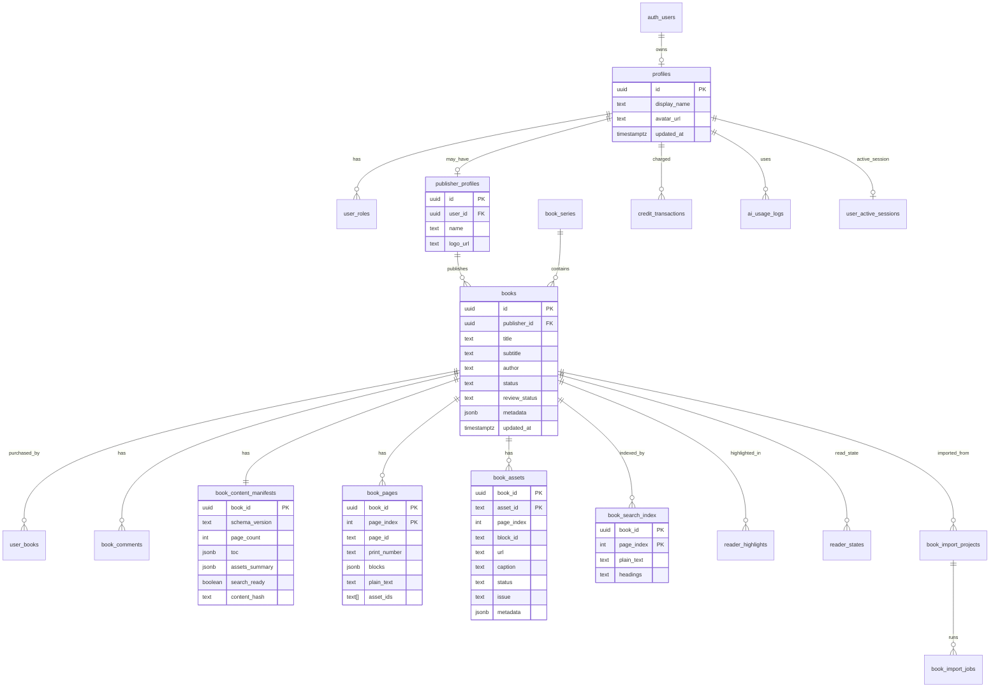

# Metabooki DFD, ERD and Security Reference

نسخه مرجع: `APP_VERSION = 1.0.619`  
تاریخ بازبینی: 2026-07-03  
این سند مکمل `SYSTEM_ARCHITECTURE_REFERENCE.md` است و روی جریان داده، ERD و کنترل‌های امنیتی تمرکز دارد.

## 1. Trust Boundaries

```mermaid
flowchart LR
  U[User Browser] -->|HTTPS anon/auth key| SPA[React SPA]
  SPA -->|Supabase JS| SB[(Supabase API)]
  SPA -->|invoke| AI[Edge Function ai-gateway]
  AI -->|server-side secret| OAI[AI Providers]
  SB --> DB[(Postgres + RLS)]
  DB --> RT[Realtime]
  RT --> SPA
```

مرزهای امنیتی:

- مرورگر فقط publishable/anon key را دارد.
- service role و AI keys فقط server-side/Edge Function هستند.
- RLS آخرین خط دفاع است؛ UI role guard فقط کمک تجربه کاربری است.
- Word قبل از تأیید ناشر local تحلیل می‌شود؛ بعد از تأیید به Supabase upload می‌شود.

## 2. Level 0 DFD

```mermaid
flowchart TD
  Reader[Reader/User] --> Store[Store and Book Landing]
  Publisher[Publisher] --> Import[Word Import]
  Publisher --> Editor[Editor V2]
  Admin[Admin] --> AdminPanel[Admin Panel]
  Store --> Supabase[(Supabase)]
  Import --> Supabase
  Editor --> Supabase
  Supabase --> ReaderApp[Reader]
  Editor --> AIGateway[AI Gateway]
  AdminPanel --> Supabase
```

## 3. Word Import DFD

```mermaid
flowchart TD
  DOCX[Word File] --> Worker[Browser Worker]
  Worker --> Local[OPFS / IndexedDB Temporary Workspace]
  Worker --> Preview[50 Page Local Preview]
  Preview --> Confirm{Publisher Confirms?}
  Confirm -- No --> Discard[Discard local analysis]
  Confirm -- Yes --> Package[Publish Package]
  Package --> Upload[Resumable Upload]
  Upload --> ImportProject[(book_import_projects)]
  Upload --> Books[(books)]
  Upload --> PageBackfill[Page Engine Backfill]
  PageBackfill --> Pages[(book_pages)]
  PageBackfill --> Manifest[(book_content_manifests)]
  PageBackfill --> Assets[(book_assets)]
  PageBackfill --> Search[(book_search_index)]
```

امنیت:

- فایل اصلی قبل از تأیید به سرور نمی‌رود.
- نتایج temporary باید با حذف پروژه یا پایان نگهداری پاک شوند.
- checksum برای ادامه upload و جلوگیری از تکرار chunk استفاده می‌شود.

## 4. Editor Save DFD

```mermaid
flowchart LR
  Editor[Editor V2] --> Dirty[Dirty Page Indexes]
  Dirty --> SaveTimer[60s Autosave or Manual Save]
  SaveTimer --> PageEngine[savePageEngineDocument]
  PageEngine -->|upsert dirty pages| Pages[(book_pages)]
  PageEngine -->|when TOC/assets changed| Manifest[(book_content_manifests)]
  PageEngine --> Search[(book_search_index)]
  PageEngine --> Assets[(book_assets)]
  Manifest --> Realtime[Supabase Realtime]
  Pages --> Realtime
  Realtime --> Reader[Reader open sessions]
```

نکته: retry سراسری Supabase برای writeهای ادیتور فعال نیست. اگر save خطا بدهد، UI باید error نشان دهد و کاربر بتواند دوباره save دستی بزند.

نکته نسخه 1.0.619:

- تشخیص صفحه خالی برای save/render بر اساس «محتوای قابل نمایش» است، نه تعداد بلوک‌ها. بنابراین صفحه‌های خالی قابل ویرایش می‌مانند و بعد از ذخیره به اشتباه حذف یا پنهان نمی‌شوند.
- Undo/Redo باید مدل سند را از DOM بازسازی کند و صفحه‌های اثرگرفته را dirty کند؛ در غیر این صورت تغییر برگشتی در Supabase ذخیره نمی‌شود.
- TOC و assets در کتاب‌های بزرگ trust کامل به window فعلی ندارند. اگر manifest ناقص باشد، از `book_pages` و `book_assets` ترمیم می‌شود و سپس دوباره در `book_content_manifests` ثبت می‌شود.
- تغییرات ارجاعات در ادیتور بخشی از همان page blocks هستند؛ بنابراین save باید فقط page dirty را upsert کند و برای افزودن/حذف لینک نیازی به ذخیره کل کتاب نیست.

## 5. Reader DFD

```mermaid
flowchart TD
  Reader[Reader Route] --> Repo[getBook]
  Repo --> Books[(books)]
  Reader --> Manifest[(book_content_manifests)]
  Reader --> WindowRPC[get_book_page_window]
  WindowRPC --> Pages[(book_pages)]
  Reader --> Renderer[BookContentBlocks + book-content rules]
  Reader --> Search{Search?}
  Search --> SearchIndex[(book_search_index)]
  Search --> PagesFallback[(book_pages fallback)]
  Reader --> Highlights[(reader_highlights)]
  Reader --> State[(reader_states)]
```

## 6. AI DFD

```mermaid
flowchart LR
  Editor[Editor/Reader/Admin UI] --> Estimate[Estimate Cost]
  Estimate --> Confirm{User Confirms?}
  Confirm -- No --> Stop[Cancel]
  Confirm -- Yes --> Gateway[ai-gateway Edge Function]
  Gateway --> Settings[(ai_provider_settings)]
  Gateway --> Provider[OpenAI / Other Provider]
  Gateway --> Usage[(ai_usage_logs)]
  Gateway --> Credit[(credit_transactions)]
  Gateway --> Result[Text/Image Result]
  Result --> Editor
```

قواعد:

- هزینه قبل از مصرف به کاربر اعلام می‌شود.
- ضریب شارژ کاربر و نرخ دلار از تنظیمات مالی محاسبه می‌شود.
- پس از تأیید، کاهش credit با animation در UI نمایش داده می‌شود؛ پیام browser alert نباید استفاده شود.

## 7. ERD خلاصه

```mermaid
erDiagram
  auth_users ||--o| profiles : owns
  profiles ||--o{ user_roles : has
  profiles ||--o| publisher_profiles : may_have
  publisher_profiles ||--o{ books : publishes
  book_series ||--o{ books : contains
  books ||--o{ user_books : purchased_by
  books ||--o{ book_comments : has
  books ||--|| book_content_manifests : has
  books ||--o{ book_pages : has
  books ||--o{ book_assets : has
  books ||--o{ book_search_index : indexed_by
  books ||--o{ reader_highlights : highlighted_in
  books ||--o{ reader_states : read_state
  books ||--o{ book_import_projects : imported_from
  book_import_projects ||--o{ book_import_jobs : runs
  profiles ||--o{ credit_transactions : charged
  profiles ||--o{ ai_usage_logs : uses
  profiles ||--o| user_active_sessions : active_session

  profiles {
    uuid id PK
    text display_name
    text avatar_url
    timestamptz updated_at
  }

  publisher_profiles {
    uuid id PK
    uuid user_id FK
    text name
    text logo_url
  }

  books {
    uuid id PK
    uuid publisher_id FK
    text title
    text subtitle
    text author
    text status
    text review_status
    jsonb metadata
    timestamptz updated_at
  }

  book_content_manifests {
    uuid book_id PK
    text schema_version
    int page_count
    jsonb toc
    jsonb assets_summary
    boolean search_ready
    text content_hash
  }

  book_pages {
    uuid book_id PK
    int page_index PK
    text page_id
    text print_number
    jsonb blocks
    text plain_text
    text[] asset_ids
  }

  book_assets {
    uuid book_id PK
    text asset_id PK
    int page_index
    text block_id
    text url
    text caption
    text status
    text issue
    jsonb metadata
  }

  book_search_index {
    uuid book_id PK
    int page_index PK
    text plain_text
    text headings
  }
```

## 8. جدول‌های اصلی و مالکیت

| جدول | مالک داده | خواندن | نوشتن |
| --- | --- | --- | --- |
| `books` | ناشر کتاب | عمومی برای published/approved؛ مالک و خریدار طبق سیاست | ناشر مالک تا قبل از قفل نشر |
| `publisher_profiles` | کاربر ناشر | خود کاربر/Admin | خود ناشر یا مسیر admin مجاز |
| `book_content_manifests` | کتاب | `can_read_book_content(book_id)` | `can_write_book_content(book_id)` |
| `book_pages` | کتاب | `can_read_book_content(book_id)` | `can_write_book_content(book_id)` |
| `book_assets` | کتاب | `can_read_book_content(book_id)` | `can_write_book_content(book_id)` |
| `book_search_index` | کتاب | `can_read_book_content(book_id)` | `can_write_book_content(book_id)` |
| `user_books` | خرید کاربر | همان کاربر/Admin | فرآیند خرید/سیستم |
| `reader_highlights` | کاربر | همان کاربر | همان کاربر |
| `ai_provider_settings` | سایت | Admin/Edge Function | Admin |
| `ai_usage_logs` | سایت/کاربر | Admin و خود کاربر در صورت نیاز | Edge Function |

## 9. RLS مهم Page Engine

تابع‌های migration:

- `public.can_read_book_content(target_book_id uuid)`
- `public.can_write_book_content(target_book_id uuid)`
- `public.get_book_page_window(target_book_id uuid, center_page integer, before_count integer, after_count integer)`

قانون read:

- کتاب منتشر و approved باشد، یا
- user مالک ناشر باشد، یا
- user کتاب را خریده باشد، یا
- user admin باشد.

قانون write:

- فقط ناشر مالک.
- اگر کتاب published است، فقط وقتی خریدی ثبت نشده باشد می‌تواند به حالت قابل ویرایش برگردد.

## 10. کنترل‌های امنیتی عملیاتی

1. هر upload کتاب باید id یکتا داشته باشد؛ عنوان یا فایل مشابه نباید باعث merge کتاب‌ها شود.
2. حذف کتاب draft باید cascade محتوای page engine، assets، search index، import jobs و metadata مرتبط را حذف کند.
3. Admin نباید از پنل نشر خودش کتاب‌های ناشرهای دیگر را ببیند؛ مشاهده کل سایت فقط از پنل Admin انجام شود.
4. session فعال کاربر در `user_active_sessions` کنترل می‌شود تا یک اکانت همزمان در چند دستگاه فعال نماند.
5. service role key هرگز وارد frontend نمی‌شود.
6. AI provider key فقط در Supabase/Edge Function ذخیره و مصرف می‌شود.
7. فایل‌های Word و محتوای کتاب در browser local workspace فقط موقت‌اند و نباید به cache عمومی یا HTML embed شوند.
8. برای GitHub Pages، chunkهای قدیمی با version cache recovery کنترل می‌شوند.

## 11. ریسک‌های شناخته‌شده

| ریسک | محل | کنترل |
| --- | --- | --- |
| اختلاف local/GitHub/Supabase | fallbackهای localStorage | Supabase source of truth، fallback فقط dev |
| payload بزرگ ذخیره ادیتور | save کامل کتاب | page-based dirty save |
| TOC ناقص در کتاب بزرگ | TOC ساخته شده از window فعلی | manifest کامل + rebuild TOC |
| تکرار کتاب با عنوان مشابه | upload بدون id یکتا | UUID هر کتاب، عدم merge با title/file |
| timeout مستقیم Supabase | شبکه ایران/Cloudflare | retry محدود read/auth، پیام شفاف اتصال |
| لو رفتن AI key | client-side storage | Edge Function و settings server-side |

## 12. چک‌لیست تغییر امن

قبل از merge هر تغییر:

1. `npm run build`
2. مسیر `/publisher/me`
3. مسیر `/edit/:id`
4. save دستی و autosave در Editor V2
5. preview از `/read/:id`
6. TOC در editor و reader
7. media list و caption
8. Supabase RLS با publisher غیرمالک
9. cache/version در `src/lib/version.ts`, `public/version.json`, `public/sw.js`
